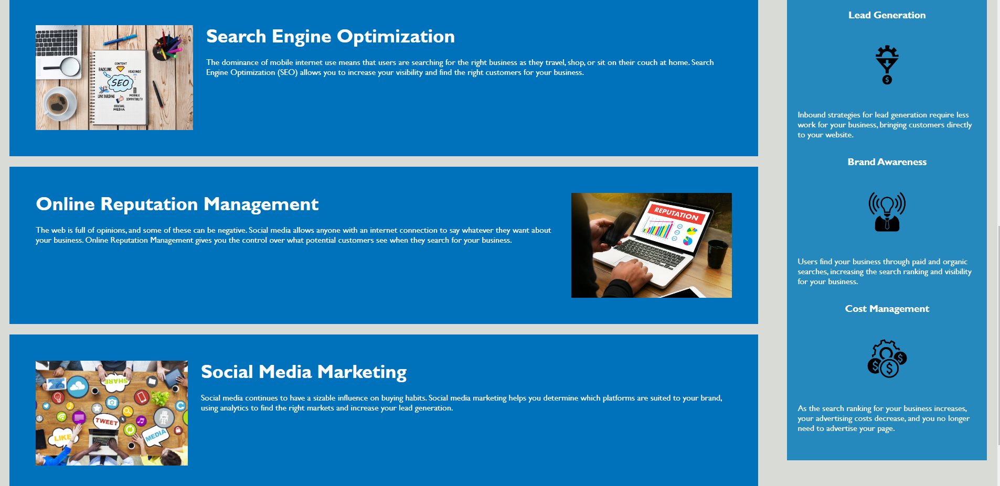

# Module 1 Project

## Description

This was a mock-up page to practice the skills developed during the module 1 of the bootcamp. It focused on making the webpage accessible, have proper semantics, deploying the webpage and adding a README file.

## Installation

N/A

## Usage

Please visit following link to see final results 

https://wesleyhas.github.io/module-1-challenge/

## Preview of Page

## Credits

Credits to Xandromus who is the original creator of this page.

https://github.com/coding-boot-camp/urban-octo-telegram

## License

Please refer to the LICENSE in the repo.